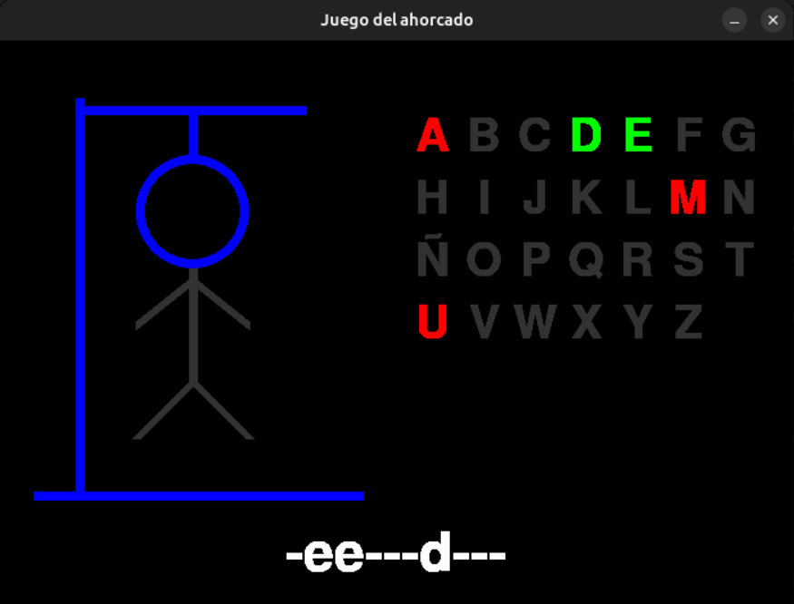

# Implementación del Juego del Ahorcado con Pygame

## Mecánica del juego

El juego del ahorcado es un juego clásico de adivinanza de palabras. Su funcionamiento básico es el siguiente:

**Inicio del juego:**

- Se selecciona una palabra secreta que el jugador debe adivinar.
- Se muestra al jugador una representación de la palabra como una serie de guiones bajos (_), donde cada guion representa una letra de la palabra.

**Turnos del jugador:**

- El jugador intenta adivinar la palabra proponiendo una letra por turno.
- Si la letra está en la palabra secreta:
  - Se revela la letra en todas las posiciones donde aparece.
- Si la letra no está en la palabra:
  - Se considera un error, y se dibuja una parte del ahorcado (por ejemplo, la cabeza, el cuerpo, los brazos, etc.).

**Progreso del juego:**

El jugador continúa adivinando letras hasta que:

- Adivine todas las letras de la palabra (gana el juego).
- Cometa un número máximo de errores (pierde el juego). En este caso, el dibujo del ahorcado estará completo.

**Final del juego:**

- Si el jugador gana, se muestra un mensaje de victoria.
- Si el jugador pierde, se revela la palabra secreta y se muestra un mensaje de derrota.

**Elementos clave del juego:**

- **Palabra secreta:** Es la palabra que el jugador debe adivinar.
- **Errores permitidos:** El número máximo de errores antes de perder el juego (generalmente 6 o 7).
- **Dibujo del ahorcado:** Representa visualmente el progreso de los errores del jugador.
- **Letras acertadas y falladas:** Se muestran al jugador para evitar repeticiones.

## Objetivo

El objetivo de esta práctica es desarrollar una versión del juego del ahorcado utilizando Python y la biblioteca Pygame. Debes implementar las funcionalidades básicas del juego, como dibujar la estructura del ahorcado, mostrar una palabra secreta, permitir al usuario adivinar letras, y actualizar el estado del juego según las respuestas correctas o incorrectas.

### Requisitos

1. Configuración Inicial:
    - Instala Pygame si no está instalado (`pip install pygame`).
    - Es recomendable que uses un entorno virtual como hemos hecho durante las katas y guardes las dependencias en el archivo `requirements.txt`
    - Utiliza las constantes definidas en el archivo `constants.py` para configurar el juego (colores, dimensiones de la ventana, gráficos del ahorcado). Puedes dejar los valores proporcionados o modificarlos a tu gusto.
    - Utiliza las funciones del archivo `utils.py` para dibujar la estructura del ahorcado y las letras del alfabeto.

2. Implementación del Juego:
    - Crea una ventana de juego con Pygame y establecer un bucle principal para manejar eventos.
    - Dibuja la estructura base del ahorcado utilizando la función `draw_base`.
    - Muestra una palabra secreta en la pantalla, inicialmente con guiones para cada letra (si usas guiones bajos como en la versión tradicional será difícil ver cuántas letras tiene la palabra).
    - Permite al usuario introducir letras y actualiza el estado del juego:
    - Si la letra está en la palabra secreta, reemplaza el guion correspondiente con la letra. Esto debes hacerlo para todas las ocurrencias de esa letra dentro de la palabra.
    - Si la letra no está en la palabra secreta, dibuja una parte del ahorcado utilizando la función `draw_part`.
    - Utiliza la función `draw_letters` para mostrar las letras del alfabeto y resaltar aquellas que han sido intentadas.

3. Condiciones de Victoria o Derrota:
    - El juego termina cuando el usuario adivina correctamente la palabra secreta o cuando el ahorcado está completo y no ha acertado la palabra.
    - Muestra un mensaje para informar al jugador del resultado final.

4. Interfaz de Usuario:
    - Asegúrate de que la interfaz sea clara y fácil de usar. Las letras deben ser legibles, y el ahorcado debe ser visible en todo momento.

5. Documentación y buenas Prácticas:
    - Incluye comentarios en el código para explicar cada sección.
    - Utiliza nombres de variables y funciones descriptivos.
    - Sigue las convenciones de estilo de Python (PEP 8).

## El archivo `sample.py`

Una vez instalado Pygame puedes ver un ejemplo simple de la interfaz ejecutando este archivo de ejemplo: `python sample.py`.

## El archivo `constants.py`

Este archivo contiene las constantes utilizadas en el juego del ahorcado. Estas constantes incluyen colores, dimensiones de la ventana y las definiciones gráficas de las partes del ahorcado.

## Colores

Constantes que representan colores en formato RGB:

- `BLACK`: Negro (0, 0, 0)
- `GREY`: Gris (50, 50, 50)
- `WHITE`: Blanco (255, 255, 255)
- `RED`: Rojo (255, 0, 0)
- `GREEN`: Verde (0, 255, 0)
- `BLUE`: Azul (0, 0, 255)

## Dimensiones

Constantes que definen las dimensiones de la ventana del juego:

- `WINDOW_W`: Ancho de la ventana, definido como 700.
- `WINDOW_H`: Altura de la ventana, definida como 500.
- `LINE_WIDTH`: Grosor de las líneas utilizadas para dibujar las partes del ahorcado, definido como 8.

## Definiciones gráficas

El diccionario `GRAPHICS` contiene las definiciones de las partes del ahorcado. Cada clave representa una parte específica, y su valor es una lista que define las coordenadas o dimensiones necesarias para dibujarla.

- `baseline`: Línea base del ahorcado. Coordenadas: `[(0, 350), (290, 350)]`.
- `stick1`: Poste vertical. Coordenadas: `[(40, 0), (40, 350)]`.
- `stick2`: Poste horizontal superior. Coordenadas: `[(40, 10), (240, 10)]`.
- `rope`: Cuerda. Coordenadas: `[(140, 10), (140, 50)]`.
- `head`: Cabeza. Coordenadas: `[(140, 100), 50]` (el segundo valor es el radio del círculo).
- `body`: Cuerpo. Coordenadas: `[(140, 150), (140, 250)]`.
- `lefthand`: Brazo izquierdo. Coordenadas: `[(140, 160), (90, 200)]`.
- `righthand`: Brazo derecho. Coordenadas: `[(140, 160), (190, 200)]`.
- `leftleg`: Pierna izquierda. Coordenadas: `[(140, 250), (90, 300)]`.
- `rightleg`: Pierna derecha. Coordenadas: `[(140, 250), (190, 300)]`.

### Notas

- Estas constantes son esenciales para el funcionamiento del juego, ya que definen los colores, dimensiones y las partes gráficas del ahorcado.
- El diccionario GRAPHICS es utilizado por las funciones de dibujo en el archivo `utils.py` para representar visualmente el progreso del juego.

## El archivo utils.py

Este archivo contiene funciones auxiliares para el juego del ahorcado que tendrás que usar para implementar el resto del juego. Aquí tienes una descripción de cada función del archivo:

### `draw_base(screen, margin_x=10, margin_y=50)`

Dibuja la base del ahorcado en la pantalla.

**Parámetros:**

- `screen`: Superficie de pygame donde se dibujará.
- `margin_x` (opcional): Margen horizontal para ajustar la posición.
- `margin_y` (opcional): Margen vertical para ajustar la posición.

**Descripción:**

Recorre las partes definidas en `GRAPHICS` y las dibuja en la pantalla utilizando la función `draw_part`.

### `draw_part(screen, key, active=False, margin_x=10, margin_y=50)`

Dibuja una parte específica del ahorcado.

**Parámetros:**

- `screen`: Superficie de pygame donde se dibujará.
- `key`: Clave que identifica la parte a dibujar (por ejemplo, "head", "body").
- `active` (opcional): Si es `True`, la parte se dibuja en color azul.
- `margin_x` (opcional): Margen horizontal para ajustar la posición.
- `margin_y` (opcional): Margen vertical para ajustar la posición.

**Descripción:**

Dibuja una parte del ahorcado. Si la parte es la cabeza, se dibuja un círculo; para otras partes, se dibuja una línea.

### `draw_word(screen, font, word)`

Dibuja la palabra del juego en la pantalla.

**Parámetros:**

- `screen`: Superficie de pygame donde se dibujará.
- `font`: Fuente de texto utilizada para renderizar la palabra.
- `word`: Palabra que se mostrará en la pantalla.

**Descripción:**

Renderiza la palabra en el centro horizontal de la pantalla, cerca de la parte inferior.

### `draw_letters(screen, font, x, y, fail='', success='')`

Dibuja el abecedario en la pantalla, indicando las letras acertadas y falladas.

**Parámetros:**

- `screen`: Superficie de pygame donde se dibujará.
- `font`: Fuente de texto utilizada para renderizar las letras.
- `x`: Coordenada inicial en el eje X.
- `y`: Coordenada inicial en el eje Y.
- `fail` (opcional): Cadena con las letras falladas.
- `success` (opcional): Cadena con las letras acertadas.

**Descripción:**

Dibuja las letras del abecedario en filas. Las letras falladas se dibujan en rojo, las acertadas en verde, y las restantes en gris. Incluye la letra "Ñ" en su posición correspondiente.

### `offset_point(point, margin_x, margin_y)`

Calcula un punto desplazado por márgenes.

**Parámetros:**

- `point`: Tupla `(x, y)` que representa el punto original.
- `margin_x`: Margen horizontal a aplicar.
- `margin_y`: Margen vertical a aplicar.

**Retorno:**

Una nueva tupla `(x + margin_x, y + margin_y)`.

**Descripción:**

Desplaza un punto dado por los márgenes especificados.

### `draw_letter(screen, font, x, char_width, line_height, pos_x, pos_y, ascii, color)`

Dibuja una letra específica en la pantalla.

**Parámetros:**

- `screen`: Superficie de pygame donde se dibujará.
- `font`: Fuente de texto utilizada para renderizar la letra.
- `x`: Coordenada inicial en el eje X.
- `char_width`: Ancho de cada carácter.
- `line_height`: Altura de cada línea.
- `pos_x`: Posición actual en el eje X.
- `pos_y`: Posición actual en el eje Y.
- `ascii`: Código ASCII de la letra a dibujar.
- `color`: Color de la letra.

**Retorno:**

Una tupla `(pos_x, pos_y)` con las nuevas coordenadas después de dibujar la letra.

**Descripción:**

Renderiza una letra en la posición especificada. Si la posición excede el ancho de la ventana, pasa a la siguiente línea.

### Constantes Importadas

El archivo utiliza varias constantes definidas en el módulo constants:

- Colores:

  - `BLUE`: Color azul.
  - `GREEN`: Color verde.
  - `GREY`: Color gris.
  - `RED`: Color rojo.
  - `WHITE`: Color blanco.

- Dimensiones:

- `WINDOW_W`: Ancho de la ventana.
- `WINDOW_H`: Altura de la ventana.

- Otros:

  - `GRAPHICS`: Diccionario que define las partes del ahorcado.
  - `LINE_WIDTH`: Grosor de las líneas.

### Notas

- Este archivo es esencial para la representación gráfica del juego del ahorcado.
- Asegúrate de que las constantes importadas estén correctamente definidas en el archivo `constants.py`.
